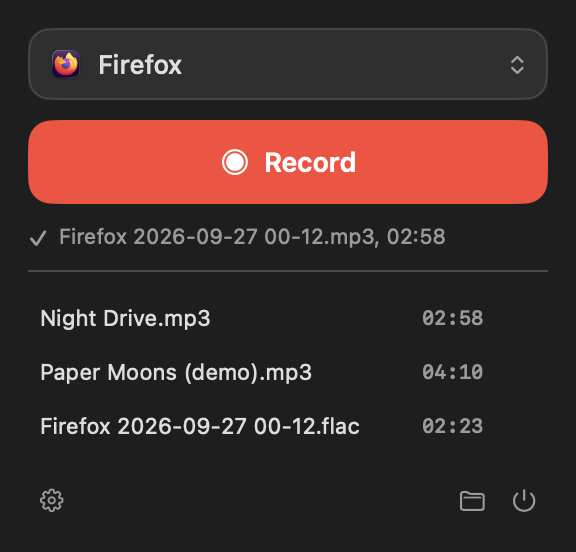
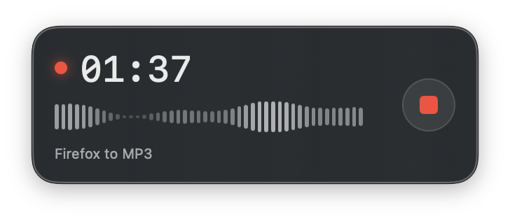
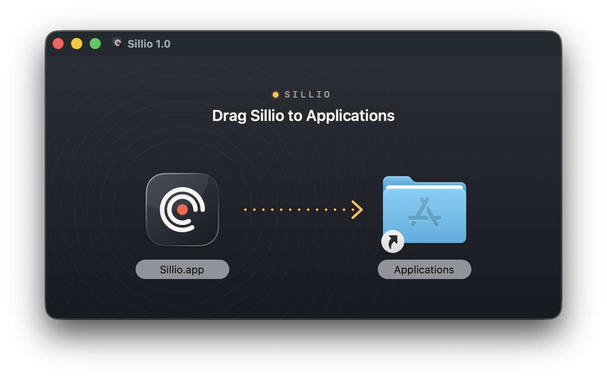

# Sillio

**Record anything your Mac plays.** A song in a browser tab, a live stream, a sound in an app:
pick the source, press the red button, get a clean file.

<p align="center">
  
  &nbsp;&nbsp;
  
</p>

Sillio lives in the menu bar. It taps the audio straight from macOS: no virtual audio driver to
install, no microphone, no quality loss, and the system volume doesn't matter. You can even mute
your speakers while it records.

## Why you'll like it

- **One app or the whole Mac.** Record only Firefox, Chrome, Safari, Spotify… or everything.
  Notifications and other apps stay out of your recording.
- **One track, one file.** Sillio waits for the first sound and stops on its own after a few
  seconds of silence. The silence at the start and end is trimmed to the exact sample.
- **Stays out of the way.** While recording, a small floating window shows the timer, the live
  level and a stop button. It stays on top of your browser, on every desktop, without ever
  stealing focus.
- **Your format.** MP3 320 kbps, M4A (AAC 256 kbps), FLAC or 24-bit WAV.
- **English or French**, following your system language.

## Install

1. Download the latest `Sillio-x.y.dmg` from the [Releases](https://github.com/zwykstudio/sillio/releases/latest) page.
2. Open it and drag Sillio to Applications.

<p align="center"></p>

3. **First launch:** Sillio isn't notarized by Apple yet, so macOS blocks a plain double-click.
   Right-click Sillio › **Open**, then confirm. You only need to do this once.
4. **First recording:** macOS asks for permission to record system audio. Allow it, or Sillio
   will only hear silence. You can change it later in System Settings › Privacy & Security ›
   Screen & System Audio Recording.

Requires **macOS 14.2** or later, on Apple silicon or Intel.

## Use it

1. Click the Sillio icon in the menu bar.
2. Choose what to record: all Mac audio, or one app (apps playing sound are marked ◀)).
3. Press **Record**, then start playback. Sillio starts at the first sound.
4. It stops by itself at the end of the track, or when you press stop.

Files go to `Music/Sillio` by default. Recent recordings appear in the panel: click to play,
drag them anywhere, right-click to show them in Finder.

Everything else sits behind the gear icon:

| Setting | What it does |
|---|---|
| **Format** | MP3, M4A, FLAC or WAV |
| **Folder** | Where recordings are saved |
| **File name** | Leave empty for an automatic name (source + date) |
| **Stop at the end of a track** | Stops after N seconds of silence |
| **Mute the speakers** | Records without the sound coming out of your speakers |
| **Floating window** | Turn it off if the menu bar timer is enough |

### Good to know

- **MP3 needs [ffmpeg](https://ffmpeg.org)**, a free tool, since macOS has no MP3 encoder.
  Without it, Sillio records in M4A. To get MP3, pick it in the settings and press
  **Install ffmpeg…**: Terminal opens and installs it with [Homebrew](https://brew.sh) (and
  Homebrew itself first if needed, after asking you). Sillio notices it right away, no restart.
  M4A, FLAC and WAV work out of the box.
- **Leave the in-app volume at 100 %** (the player's own slider). The system volume doesn't
  matter.
- **Open the app before you start recording.** If it has no audio process yet, Sillio waits for
  it, but the very first fraction of a second may be lost.
- The source is often already compressed: pick FLAC or WAV to avoid compressing it twice.

## Command line

Sillio also has a command-line twin, `sillio`, built on the same engine. It isn't in the DMG:
build it from source (see below), then put it on your `PATH`.

```sh
sillio list                                   # apps with an audio output (▶ = playing)
sillio -a firefox --auto -o "my song.mp3"     # start it, then press play
sillio -a chrome -m --auto -o track.flac      # -m: muted in the speakers while recording
sillio -d 60                                  # all Mac audio, 60 s max
```

| Option | |
|---|---|
| `-a, --app NAME` | One app only (part of its name or bundle id) |
| `-o, --out FILE` | `.mp3` (default), `.m4a`, `.flac`, `.wav`… Never overwrites a file |
| `--auto` | Stop after a silence (3 s, change it with `-s SEC`) |
| `-d, --duration SEC` | Maximum length |
| `-m, --mute` | Mute the app in the speakers while recording |

Without `--auto`, press Ctrl-C to stop; the file is saved. The permission is asked for the
terminal you run it from.

## Build from source

No Xcode project, no dependencies: the Swift compiler and the macOS SDK are enough.

```sh
git clone https://github.com/zwykstudio/sillio.git && cd sillio
./build.sh          # builds ./sillio and ./Sillio.app for this Mac
open Sillio.app
./package.sh 1.1    # universal build (Apple silicon + Intel) → dist/Sillio-1.1.dmg
```

To sign and notarize the DMG with an Apple Developer ID, set `SILLIO_SIGN_ID` and
`SILLIO_NOTARY_PROFILE` (details at the top of `package.sh`).

## How it works

Sillio uses Core Audio **process taps** (macOS 14.2+) to read the audio of one process, or of
the whole system, before it reaches the output device. Browsers play sound from helper
processes, so Sillio groups them under the app they belong to: `firefox` is enough. Samples are
written as-is while recording, then encoded when you stop.

```
Sources/Engine.swift         capture, silence detection, export
Sources/App/                 the menu bar app (SwiftUI)
Sources/CLI/main.swift       the sillio command
Sources/Localization.swift   English / French strings
Tools/                       icon and DMG background generators
```

## License

[MIT](LICENSE) © 2026 ZWYK Studio
